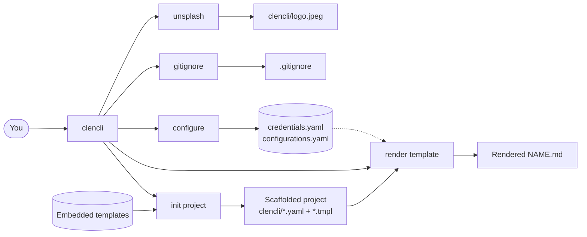
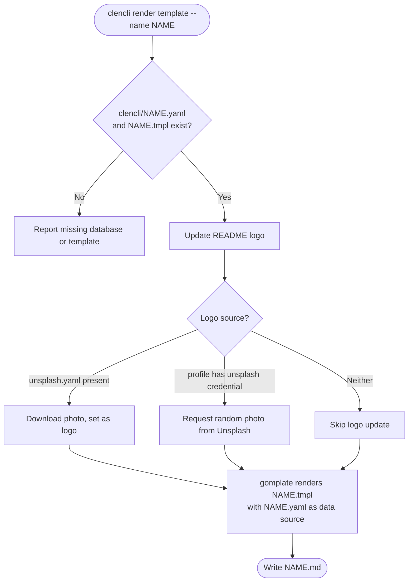

# Cloud Engineer CLI (clencli)

A command line tool that scaffolds standardized project structures and renders project documentation from YAML.

[](https://github.com/awslabs/clencli/issues)
[](https://github.com/awslabs/clencli/network)
[](https://github.com/awslabs/clencli/stargazers)
[](https://github.com/awslabs/clencli/blob/main/LICENSE)

## Overview

In a polyglot environment where each team picks its own programming language, repositories tend to drift apart in structure and documentation. clencli addresses this by giving you a consistent way to scaffold a project layout and to render documentation from a single YAML data file.

You describe your README (or any other document) once in a `clencli/<name>.yaml` data file paired with a `clencli/<name>.tmpl` template, then run `clencli render template` to produce the Markdown output. clencli also scaffolds new projects (basic, cloud, AWS CloudFormation, and Terraform layouts), downloads `.gitignore` files, and retrieves photos from Unsplash for use as project artwork.

clencli is written in Go and is distributed in the `awslabs` GitHub organization. It is not an officially supported AWS product.

## Features

- Scaffold new projects in `basic`, `cloud`, `cloudformation`, or `terraform` layouts.
- Render Markdown documents from a YAML data file and a Go template.
- Download `.gitignore` files from the gitignore.io API by type.
- Download photos from Unsplash to use as project artwork.
- Manage named profiles of credentials and configurations.

## Prerequisites

- Go 1.16 or later, if you build from source.
- A network connection for the `gitignore` and `unsplash` commands, which call external APIs.
- An Unsplash API key, only if you use the `unsplash` command or Unsplash-backed artwork. See [Configuration](#configuration).

## Installation

clencli embeds its template resources into the binary at build time using a code generation step. Build it from source with the Go toolchain.

1. Clone the repository.

   ```bash
   git clone https://github.com/awslabs/clencli.git
   cd clencli
   ```

2. Generate the embedded resources and build the binary.

   ```bash
   go generate ./...
   go build -o clencli .
   ```

3. Move the binary onto your `PATH`.

   ```bash
   sudo mv clencli /usr/local/bin/
   ```

You can also download a prebuilt binary for your platform from the [releases page](https://github.com/awslabs/clencli/releases) and place it on your `PATH`.

If the build fails to resolve dependencies, see [Troubleshooting](#troubleshooting).

## Getting started

Initialize a basic project and render its README.

```bash
clencli init project --project-name foo
```

```text
foo was successfully initialized as a basic project
```

This creates the following layout:

```text
foo/
├── clencli
│   ├── readme.tmpl
│   └── readme.yaml
└── .gitignore
```

Render the README from the generated template and data file.

```bash
cd foo
clencli render template
```

```text
Template readme.tmpl rendered as README.md.
```

The `README.md` is generated from `clencli/readme.yaml` and `clencli/readme.tmpl`. Edit the YAML data file, then re-run `clencli render template` to regenerate the document.

## Usage

The following examples cover the most common tasks. For the full command reference, see [COMMANDS.md](COMMANDS.md).

Create a Terraform project:

```bash
clencli init project --project-name foo --project-type terraform
```

```text
foo/
├── clencli
│   ├── hld.tmpl
│   ├── hld.yaml
│   ├── readme.tmpl
│   └── readme.yaml
├── environments
│   ├── dev.tf
│   └── prod.tf
├── .gitignore
├── LICENSE
├── main.tf
├── Makefile
├── outputs.tf
└── variables.tf
```

Render a named template other than the default `readme`:

```bash
clencli render template --name hld
```

Download a `.gitignore` file for one or more types:

```bash
clencli gitignore --input terraform,visualstudiocode
```

```text
.gitignore created successfully
```

List the valid `.gitignore` types:

```bash
clencli gitignore list
```

Print the version:

```bash
clencli version
```

```text
clencli v0.3.6 go1.16 linux amd64
```

## Configuration

clencli stores credentials and configurations as YAML files in your user configuration directory, under a `clencli` subdirectory. The location is platform-specific: `~/.config/clencli` on Linux, `~/Library/Application Support/clencli` on macOS, and `%AppData%\clencli` on Windows.

| File | Purpose |
| --- | --- |
| `credentials.yaml` | Named profiles of API credentials, such as an Unsplash access key and secret key. |
| `configurations.yaml` | Named profiles of settings, such as Unsplash random-photo parameters and customized project initialization. |

Run `clencli configure` to create or update these files interactively. Use `--profile <name>` to target a named profile other than `default`:

```bash
clencli configure --profile work
```

Delete a profile:

```bash
clencli configure delete --profile work
```

Credentials and configuration files are written with `0600` permissions. The `unsplash` command and Unsplash-backed artwork require an `unsplash` credential in the active profile.

Global flags apply to every command:

| Flag | Default | Description |
| --- | --- | --- |
| `-p`, `--profile` | `default` | Use a specific profile from your credentials and configurations files. |
| `-v`, `--verbosity` | `error` | Log level. Valid values: `panic`, `fatal`, `error`, `warn`, `info`, `debug`, `trace`. |
| `--log` | `true` | Enable or disable logging to a file. When disabled, log output goes to the default output. |
| `--log-file-path` | `clencli/log.json` | Log file path. Requires `--log=true`. |

## How it works

clencli reads a YAML data file (`clencli/<name>.yaml`) and a matching Go template (`clencli/<name>.tmpl`), then uses [gomplate](https://github.com/hairyhenderson/gomplate) to render the template into a Markdown file named `<NAME>.md`. Template resources for project scaffolding are embedded into the binary at build time. The CLI itself is built with [Cobra](https://github.com/spf13/cobra) and [Viper](https://github.com/spf13/viper).

The following diagram shows the clencli commands and the resources they read or write.



The next diagram shows the `render template` flow, from validation through gomplate output.



## Troubleshooting

**The build fails with `invalid version: unknown revision` for a gomplate dependency.**

The version on the `main` branch pins `gomplate/v3`, whose transitive dependency `github.com/hairyhenderson/toml` references a revision that no longer resolves. Until the dependency is updated, use a prebuilt binary from the [releases page](https://github.com/awslabs/clencli/releases).

**The `unsplash` command reports `no unsplash credential found or no profile enabled`.**

Add an `unsplash` credential to the active profile with `clencli configure`, then retry. See [Configuration](#configuration).

**`render` reports a missing database or template.**

The `render` command requires both `clencli/<name>.yaml` and `clencli/<name>.tmpl` to exist in the current directory. Run `clencli init project` first, or create the files manually.

## Contributing

See [CONTRIBUTING.md](CONTRIBUTING.md).

## Security

See [CONTRIBUTING.md](CONTRIBUTING.md) for how to report security issues, or use the [AWS vulnerability reporting page](https://aws.amazon.com/security/vulnerability-reporting/).

## License

This project is licensed under the Apache License 2.0. See [LICENSE](LICENSE).
